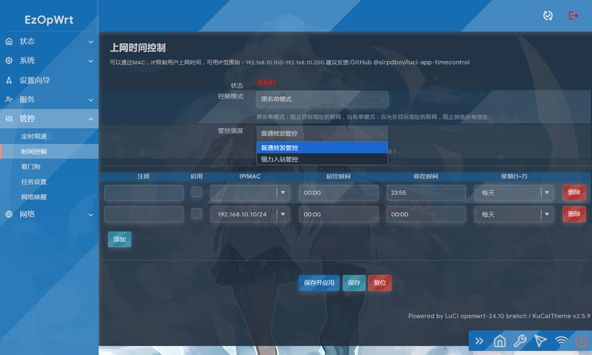

## 访问数：[](https://t.me/joinchat/AAAAAEpRF88NfOK5vBXGBQ)
### 访问数：[] [](https://t.me/joinchat/AAAAAEpRF88NfOK5vBXGBQ)

[timecontrol  上网时间控制插件](https://github.com/sirpdboy/luci-app-timecontrol)


请 **认真阅读完毕** 本页面，本页面包含注意事项和如何使用。

## 功能说明：

### 上网时间控制NFT版2.0.2版

#### 专门针对24.10分支，适配NFT的上网时间控制插件。21.04NFT版名字：luci-app-nft-timecontrol 2.X ,18.06名字：luci-app-timecontrol 1.X（早期几年前做的版本）


## 编译使用方法 [](#编译使用方法-)

将luci-app-timecontrol添加至 LEDE/OpenWRT 源码的方法。

### 下载源码方法一：
编辑源码文件夹根目录feeds.conf.default并加入如下内容:

```Brach
    # feeds获取源码：
    src-git timecontrol  https://github.com/sirpdboy/luci-app-timecontrol
 ``` 
  ```Brach
   # 更新feeds，并安装主题：
    scripts/feeds update timecontrol
	scripts/feeds install luci-app-timecontrol
 ``` 	

### 下载源码方法：
 ```Brach
    # 下载源码
    git clone https://github.com/sirpdboy/luci-app-timecontrol package/luci-app-timecontrol
    make menuconfig
 ``` 
### 配置菜单
 ```Brach
    make menuconfig
	# 找到 LuCI -> Applications, 选择 luci-app-timecontrol（18.06 timecontrol，24.10选择nft-timecontrol), 保存后退出。
 ``` 
### 编译
 ```Brach 
    # 编译固件
    make package/luci-app-timecontrol/compile V=s
 ```

## 说明 [](#说明-)

源码来源：https://github.com/sirpdboy/luci-app-timecontrol


- 你可以随意使用其中的源码，但请注明出处。


## 界面



# My other project

- 路由安全看门狗 ：https://github.com/sirpdboy/luci-app-watchdog
- 网络速度测试 ：https://github.com/sirpdboy/luci-app-netspeedtest
- 计划任务插件（原定时设置） : https://github.com/sirpdboy/luci-app-taskplan
- 关机功能插件 : https://github.com/sirpdboy/luci-app-poweroffdevice
- opentopd主题 : https://github.com/sirpdboy/luci-theme-opentopd
- kucat酷猫主题: https://github.com/sirpdboy/luci-theme-kucat
- kucat酷猫主题设置工具: https://github.com/sirpdboy/luci-app-kucat-config
- NFT版上网时间控制插件: https://github.com/sirpdboy/luci-app-timecontrol
- 家长控制: https://github.com/sirpdboy/luci-theme-parentcontrol
- 定时限速: https://github.com/sirpdboy/luci-app-eqosplus
- 系统高级设置 : https://github.com/sirpdboy/luci-app-advanced
- ddns-go动态域名: https://github.com/sirpdboy/luci-app-ddns-go
- 进阶设置（系统高级设置+主题设置kucat/agron/opentopd）: https://github.com/sirpdboy/luci-app-advancedplus
- 网络设置向导: https://github.com/sirpdboy/luci-app-netwizard
- 一键分区扩容: https://github.com/sirpdboy/luci-app-partexp
- lukcy大吉: https://github.com/sirpdboy/luci-app-lukcy

## 捐助


|       |    | 
| :-----------------: | :-------------: |
| |  |

<a href="#readme">
    
</a>
