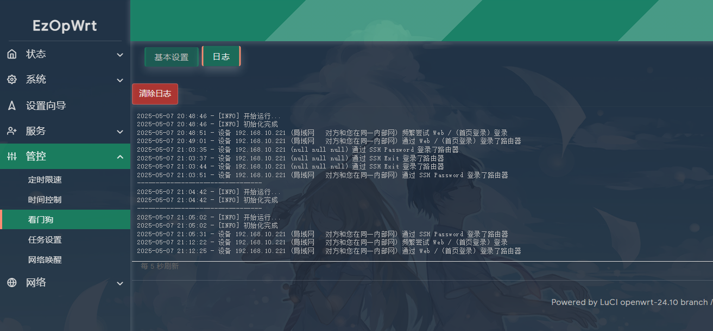
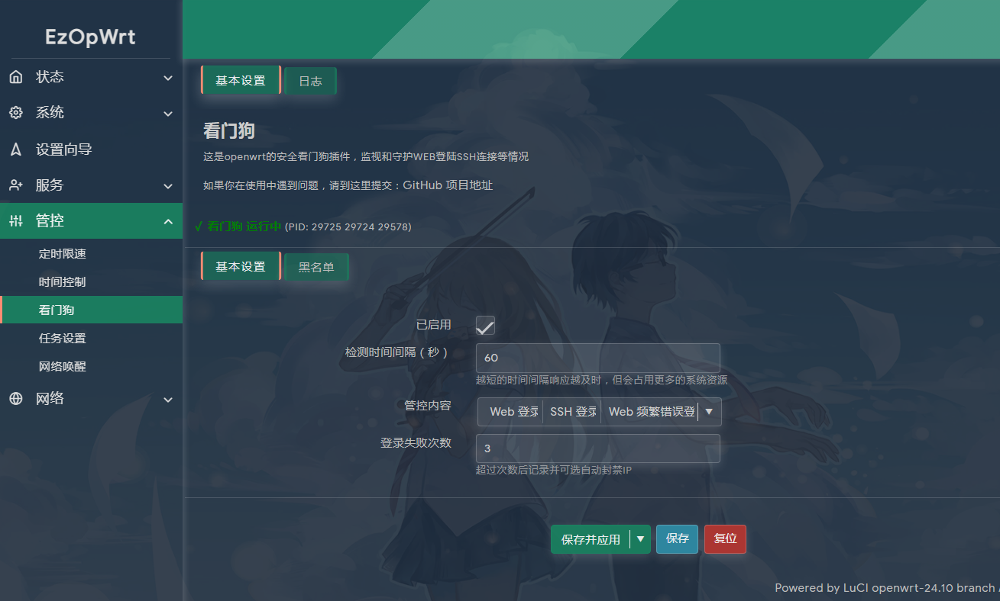

## 访问数：[](https://t.me/joinchat/AAAAAEpRF88NfOK5vBXGBQ)
### 访问数：[] [](https://t.me/joinchat/AAAAAEpRF88NfOK5vBXGBQ)


### 源码仓库：  

## git clone  https://github.com/sirpdboy/luci-app-watchdog

插件特色： 解决OPENWRT安全登陆管控问题，适配openwr24.10, 自动适配iptablet FW3和nft FW4.  可以监控WEB页和SSH登陆情况。 失败多次后自动拉黑到黑名单。


## 2025.7.11  看门狗 v1.0.5 解决OPENWRT安全问题。

更新日志：

1. 修复pidof显示问题。

2. 优化日志显示英文的问题。

## 2025.5.11  看门狗 v1.0.3 解决OPENWRT安全问题。

更新日志：

1. 解决上一版本服务启动不及时响应问题。

2. 增加加入黑名单提示，删除黑名单提示。

3. 优化日志显示英文的问题。 

## 2025.5.1  看门狗 v1.0.1 解决OPENWRT安全问题。

更新日志：

1. 解决上一版本服务启动过多问题。

2. 插件超过一年使用权，开源给TG群的好伙伴们享用。好用请进TG群并点赞！！


## 2024.3.24  看门狗 1.0 解决OPENWRT安全管控问题。

更新日志：

1. 因好伙伴需要，定制插件看门狗 1.0.

2. 可以监控WEB页和SSH登陆情况。

3. 失败多次后自动拉黑到黑名单。
 
 ### 下载源码方法:

 ```Brach
 
    # 下载源码
	
    git clone https://github.com/sirpdboy/luci-app-watchdog package/watchdog
    make menuconfig
	
 ``` 
### 配置菜单

 ```Brach
    make menuconfig
	# 找到 LuCI -> Applications, 选择 luci-app-watchdog, 保存后退出。
 ``` 
 
### 编译

 ```Brach 
    # 编译固件
    make package/watchdog/luci-app-watchdog/compile V=s
 ```
 
 ## 界面






---------------
 
 

## 使用与授权相关说明
 
- 本人开源的所有源码，任何引用需注明本处出处，如需修改二次发布必告之本人，未经许可不得做于任何商用用途。


# My other project

- 路由安全看门狗 ：https://github.com/sirpdboy/luci-app-watchdog
- 网络速度测试 ：https://github.com/sirpdboy/luci-app-netspeedtest
- 计划任务插件（原定时设置） : https://github.com/sirpdboy/luci-app-taskplan
- 关机功能插件 : https://github.com/sirpdboy/luci-app-poweroffdevice
- opentopd主题 : https://github.com/sirpdboy/luci-theme-opentopd
- kucat酷猫主题: https://github.com/sirpdboy/luci-theme-kucat
- kucat酷猫主题设置工具: https://github.com/sirpdboy/luci-app-kucat-config
- NFT版上网时间控制插件: https://github.com/sirpdboy/luci-app-timecontrol
- 家长控制: https://github.com/sirpdboy/luci-theme-parentcontrol
- 定时限速: https://github.com/sirpdboy/luci-app-eqosplus
- 系统高级设置 : https://github.com/sirpdboy/luci-app-advanced
- ddns-go动态域名: https://github.com/sirpdboy/luci-app-ddns-go
- 进阶设置（系统高级设置+主题设置kucat/agron/opentopd）: https://github.com/sirpdboy/luci-app-advancedplus
- 网络设置向导: https://github.com/sirpdboy/luci-app-netwizard
- 一键分区扩容: https://github.com/sirpdboy/luci-app-partexp
- lukcy大吉: https://github.com/sirpdboy/luci-app-lukcy

## 捐助


|       |    | 
| :-----------------: | :-------------: |
| |  |

<a href="#readme">
    
</a>
